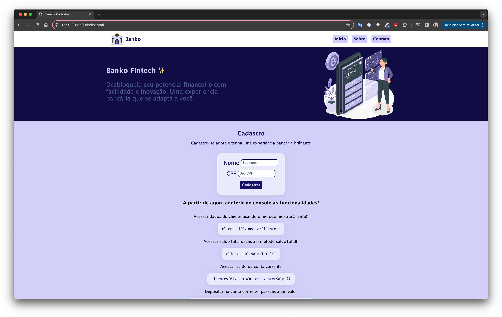

# Banko - Fintech
Repositório destinado a projeto de banco do módulo 3 da Formação de Front end da Ada Tech. 

## Funciolidades no console:
Acessar saldo total usando o método saldoTotal()

`clientes[0].saldoTotal()`

Acessar saldo da conta corrente

`clientes[0].contaCorrente.obterSaldo()`

Depositar na conta corrente, passando um valor

`clientes[0].contaCorrente.adicionar(100)   //Fulano, foi adicionado R$100. Agora seu saldo é R$100.`

Sacar na conta corrente, , passando um valor

`clientes[0].contacorrente.remover(20)`

Pagar taxa do banco com a conta corrente

`clientes[0].contacorrente.cobrarTaxa()`

Acessar saldo da conta poupança

`clientes[0].contapoupanca.obterSaldo()`

Depositar na conta corrente, passando um valor

`clientes[0].contapoupanca.adicionar(100)`

Sacar na conta corrente, passando um valor

`clientes[0].contapoupanca.remover(10)`

Investir saldo da conta poupança

`clientes[0].contapoupanca.investir()`

## Tecnologias usadas:
- HTML
- CSS
- JavaScript

## Deploy:
Veja no seu navegador: [Banko](https://portfolio-day-mariano.vercel.app/)

