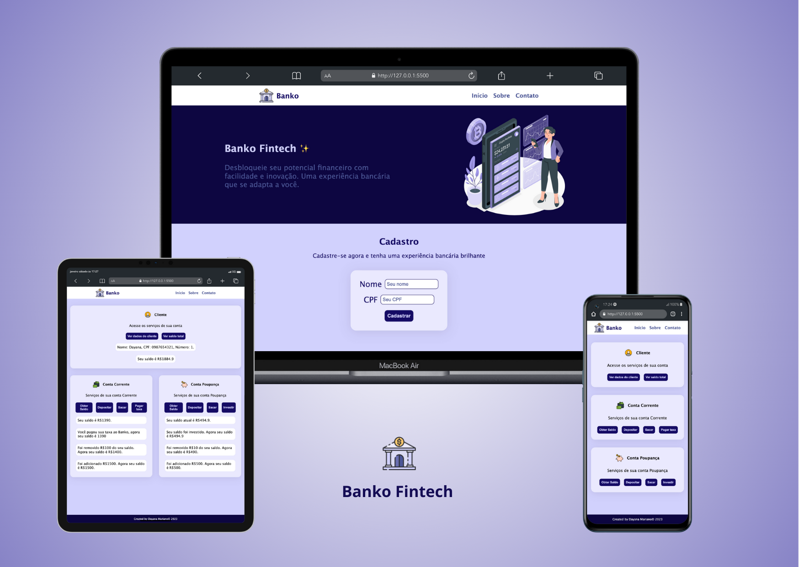

# Banko - Fintech
Repositório destinado a projeto de banco do módulo 3 da Formação de Front end da Ada Tech. Esta aplicação permite ao usuário criar cadastro, e fazer operações nas sua Conta Corrente e Conta Poupança.

## Funciolidades:
- Acessar saldo total
- Acessar saldo da conta corrente
- Depositar na conta corrente, passando um valor
- Sacar na conta corrente, passando um valor
- Pagar taxa do banco com a conta corrente
- Acessar saldo da conta poupança
- Depositar na conta corrente, passando um valor
- Sacar na conta corrente, passando um valor
- Investir saldo da conta poupança

## Tecnologias usadas:
- HTML
- CSS
- JavaScript
- Vercel

## Deploy:
Veja no seu navegador: [Banko](https://banko-fintech.vercel.app/)

